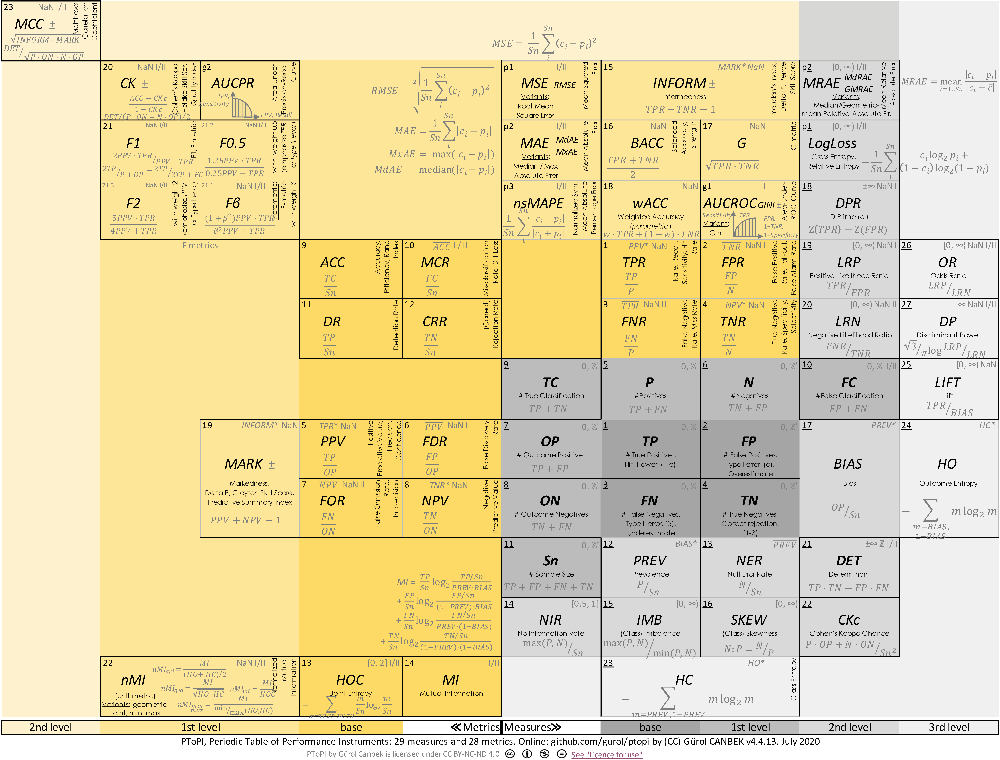

## PToPI – A Research Compedium of
# A Comprehensive Analysis and Knowledge Representation of Binary Classification Performance Measures/Metrics

   

This platform is a research compedium of our academic publication below.

> [Gürol Canbek](http:gurol.canbek.com/Publications), Tugba Taskaya Temizel, and Seref Sagiroglu (2021). A Comprehensive Analysis and Knowledge Representation of Binary Classification Performance Measures/Metrics, *IEEE Access*, IEEE (submitted).

The platform provides the following materials:
- **PToPI.xlsx**: Periodic Table of (Binary-Classification) Performance (Evaluation) Instruments (open with Microsoft Excel™)
- **PToPI.dot**, **PToPI_NonRedundantMetricsOnly.dot**, and **PToPI.pdf**: Dependency graph codes and outputs for 57 performance measures and metrics ([Graphviz file](https://www.graphviz.org)). You can try dot files online at (https://edotor.net)
<!-- - **accbarrier.R**: Open-source R script for calculating the new classification **performance indicator called Accuracy Barrier (*ACCBAR*)** ([R](https://www.r-project.org) file) -->

An exploratory table (PToPI) presents the novel concepts introduced from multi-perspective analysis of **57 binary-classification performance instruments** (29 measures and 28 metrics with 12 variant and parametric instruments). It is like a "periodic table of elements" in chemisstry.
<!-- The indicator is proposed in the article above to identify whether the classification performance is close to random classifier's performance. -->

Please, refer to http://dx.doi.org/10.17632/5c442vbjzg.3 for the Mendeley Data (**Binary-Classification Performance Evaluation Reporting Survey Data with the Findings**) providing comprehensive findings related to binary-classification performance evaluation reporting issues of **78 academic studies** within the recent 7 years (2012–2018) that model some machine learning based **Android malware detection classifiers** and report their performance evaluation using some metrics.

**Note**: Please, cite our article if you would like to use and/or adapt the code, datasets, methodology, and other materials provided and let us know. Thank you for your interest. Be aware that **the exploratory table/tool PToPI by Gürol Canbek is licensed under [CC BY-NC-ND 4.0](https://creativecommons.org/licenses/by-nc-nd/4.0/legalcode)**. You can use PToPI for personal purposes or academical studies by giving a citation to the article above. See the "license for use" in the spreadsheet file.

The following measures/metrics are presented in PToPI (alphabetic order with alternative naming):
[//]: # (## Performance Measures (29 measures))
[//]: # (### Base Measures (BM) (4 measures)1)
[//]: # (- ***FN***: False Negatives)
[//]: # (- ***FP***: False Positives)
[//]: # (- ***TN***: True Negatives)
[//]: # (- ***TP***: True Positives)
[//]: # (### 1st Level Measures (7 measures)1)
[//]: # (- ***N***: Negatives)
[//]: # (- ***P***: Positives)
[//]: # (- ***ON***: Outcome Negatives)
[//]: # (- ***OP***: Outcome Positives)
[//]: # (- ***FC***: False Classification2)
[//]: # (- ***TC***: True Classification2)
[//]: # (- ***Sn***: Sample Size)
[//]: # (### 2nd Level Measures (16 measures))
[//]: # (- *BIAS*: Bias)
[//]: # (- *CKc*: Cohen's Kappa Chance,)
[//]: # (- ***DET***: Determinant)
[//]: # (- *DPR*: D Prime)
[//]: # (- *IMB*: (Class) Imbalance)
[//]: # (- *LRN*: Negative Likelihood Ratio)
[//]: # (- *LRP*: Positive Likelihood Ratio)
[//]: # (- *NER*: Null Error Rate)
[//]: # (- *NIR*: No Information Rate (non-information rate))
[//]: # (- *PREV*: Prevalence)
[//]: # (- *SKEW*: (Class) Skew)
[//]: # ((Probabilistic error/loss measures):)
[//]: # (- *LogLoss*: (binary cross-entropy))
[//]: # (- *MRAE*: Mean Relative Absolute Error)
[//]: # (### 3rd Level Measures (4 measures))
[//]: # (- *DP*: Discriminant Power)
[//]: # (- *HC*: Class Entropy3)
[//]: # (- *HO*: Outcome Entropy3)
[//]: # (- *LIFT*: Lift)
[//]: # (- *OR*: Odds Ratio)
[//]: # (## Performance Metrics (28 metrics))
[//]: # (### Base Metrics (14 metrics))
[//]: # (- *ACC*: Accuracy (efficiency, rand index))
[//]: # (- *CRR*: (Correct) Rejection Rate)
[//]: # (- *DR*: Detection Rate)
[//]: # (- *FDR*: False Discovery Rate)
[//]: # (- *FNR*: False Negative Rate (miss rate))
[//]: # (- *FOR*: False Omission Rate (imprecision))
[//]: # (- *FPR*: False Positive Rate (fall-out))
[//]: # (- *HOC*: Joint Entropy3)
[//]: # (- *MCR*: Misclassification Rate)
[//]: # (- *MI*: Mutual Information*)
[//]: # (- *NPV*: Negative Predictive Value)
[//]: # (- *PPV*: Positive Predictive Value (precision, confidence))
[//]: # (- *TNR*: True Negative Rate (inverse recall, specificity))
[//]: # (- *TPR*: True Positive Rate (recall, sensitivity, hit rate, recognition rate))
[//]: # (### 1st Level Metrics (13 metrics))
[//]: # (- *BACC*: Balanced Accuracy (strength))
[//]: # (- *CK*: Cohen's Kappa (Heidke skill score, quality index))
[//]: # (- *F1*: F metric (F-score, F-measure, positive specific agreement) (parametric: *Fβ*, e.g., *F0.5*, and *F2* : F metric with weight β, 0.5, and 2))
[//]: # (- *G*: G metric (G-mean, Fowlkes-Mallows index))
[//]: # (- *INFORM*: Informedness (Youden’s index, delta P', Peirce skill score))
[//]: # (- *MARK*: Markedness (delta P, Clayton skill score, predictive summary index))
[//]: # (- *nMI*: Normalized Mutual Information3)
[//]: # (- *wACC*: Weighted Accuracy (parametric))
[//]: # ((Graphical metrics):)
[//]: # (- *AUCROC*: Area-Under-ROC-Curve (ROC: Receiver Operating Curve))
[//]: # (- *AUCPR*: Area-Under-Precision-Recall-Curve)
[//]: # ((Probabilistic error/loss metrics):)
[//]: # (- *MSE*: Mean Squared Error (variants: *RMSE*: Root Mean Square Error))
[//]: # (- *MAE*: Mean Absolute Error (variants: *MdAE*: Median Absolute Error, *MxAE*: Maximum Absolute Error))
[//]: # (- *nsMAPE*: Normalized Symmetric Mean Absolute Percenage Error)
[//]: # (### 2nd Level Metric (1 metric))
[//]: # (- *MCC*: Matthews Correlation Coefficient (Phi correlation coefficient, Cohen’s index, Yule phi))
[//]: # (Notes:)
[//]: # (1. We propose "canonical measures" as the combination of base and 1st level measures)
[//]: # (2. We introduce ***TC*** and ***FC*** as the diagonal and off-diagonal confusion matrix elements (*i.e.* base measures))
[//]: # (3. Entropic instruments (*HC*, *HO*, *HOC*, *MI*, and *nMI*)
